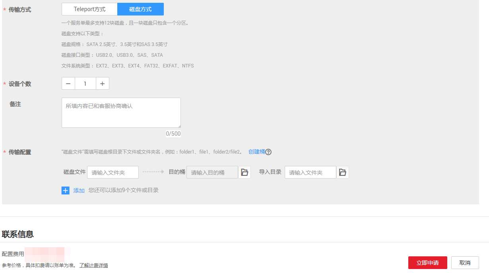

# 创建磁盘方式服务单

## 背景信息

用户待迁移数据已存储在自己的存储设备中，并能邮寄自己的存储设备到华为数据中心，1111111择创建磁盘方式服务单，来使用DES。用户自己存储设备的支持的类型参见[表1](#d0e2003)。

> **说明：**   
>一个服务单最多支持12块磁盘，且一块磁盘只包含一个分区。  

**表 1**  磁盘兼容性

<table><thead align="left"><tr id="row59531373"><th class="cellrowborder" valign="top" width="33.33%" id="mcps1.2.3.1.1">
兼容性

</th>
<th class="cellrowborder" valign="top" width="66.67%" id="mcps1.2.3.1.2">
支持规格

</th>
</tr>
</thead>
<tbody><tr id="row12573920"><td class="cellrowborder" valign="top" width="33.33%" headers="mcps1.2.3.1.1 ">
磁盘规格

</td>
<td class="cellrowborder" valign="top" width="66.67%" headers="mcps1.2.3.1.2 ">
SATA 2.5英寸、SATA 3.5英寸、SAS 3.5英寸。

</td>
</tr>
<tr id="row52078514"><td class="cellrowborder" valign="top" width="33.33%" headers="mcps1.2.3.1.1 ">
磁盘接口

</td>
<td class="cellrowborder" valign="top" width="66.67%" headers="mcps1.2.3.1.2 ">
USB2.0、USB3.0、SAS、SATA。

</td>
</tr>
<tr id="row54712068"><td class="cellrowborder" valign="top" width="33.33%" headers="mcps1.2.3.1.1 ">
磁盘文件系统

</td>
<td class="cellrowborder" valign="top" width="66.67%" headers="mcps1.2.3.1.2 ">
EXT2、EXT3、EXT4、FAT32、EXFAT、NTFS。

</td>
</tr>
</tbody>
</table>

## 操作步骤

1.  登录DES管理控制台。
2.  根据规划，切换数据中心，用户可就近选择。如[图1](#fig75102056829)所示。

    **图 1**  磁盘方式切换数据中心  
    

3.  单击“服务列表”\>“存储”\>“数据快递服务”，进入数据快递服务管理控制台。单击“申请数据快递服务”。
4.  选择“磁盘方式”传输方式。
5.  填写“传输信息”。如[图2](#fig109565610320)所示。

    **图 2**  填写磁盘方式传输信息  
    

    -   “磁盘文件”：填写用户磁盘根目录下文件或文件夹名称。若填写文件或文件夹名称，表示将该文件数据或文件夹中的所有数据传输到指定的目的桶中；若不填写，则默认将磁盘中所有文件传输到目的桶。

        一个输入框中只能填写一个文件或文件夹名称，若需要传输多个文件或文件夹，可单击“添加”，填写多个不同的磁盘目录。例如：用户磁盘中的根目录下包含“test01”和“test02”两个文件夹，用户可将这两个文件夹分别填写到不同的“磁盘文件”的输入框中，且可以选择不同的“目的桶”，实现数据分类。

        > **说明：**   
        >文件夹名称不能包括以下字符：\\/:\*?"<\>|，不能以.开头。  

    -   “目的桶”：单击目的桶后面的“文件夹”图标，选择磁盘数据传输的目的桶。若目的桶不存在，可单击“创建桶”,创建可用的桶后，再刷新目的桶并重试；也可以登录[控制台](https://console.huaweicloud.com)，选择对象存储服务，创建可用的桶后，再刷新目的桶并重试。
    -   “导入目录”：单击导入目录后面“文件夹”图标，选择数据即将导入到桶中的具体目录。您也可以手工输入目录名称，后台会把会把数据保存在该目录中。

        > **说明：**   
        >文件或者目录最多只能添加10个。  

6.  新建收货地址，首次创建服务单需要填写用户收货地址，用于华为数据中心寄回磁盘。如[图3](#fig19986201415315)所示。

    **图 3**  磁盘方式新建收货地址  
    

    -   “联系人”：填写联系人姓名。
    -   “收货地址”：填写联系人所在的省、市、区地址。
    -   “详细地址”：填写详细的小区或者街道地址以及门牌号等信息。
    -   “手机号码”：填写联系人手机号码。
    -   “短信验证码”：点击获取验证码。

        > **说明：**   
        >收货地址最多只能创建5条。  

7.  单击“立即申请”，提示信息单击“确认”，进入服务单详情界面。如[图4](#fig351619241933)所示。

    **图 4**  磁盘方式服务单详情  
    

    > **说明：**   
    >请仔细查看服务单详情，如果信息有误，单击“上一步”进行修改。  

8.  单击“提交申请”，提交服务单。

    服务单创建成功后，进入如[图5](#fig24931621843)所示界面。

    **图 5**  磁盘方式服务单提交成功  
    

    > **注意：**   
    >可以在此处“下载签名文件”，也可以在服务单列表后面单击“下载签名文件”。  

9.  （可选）：进入华为云[开发者中心](http://developer.huaweicloud.com/tools/des.html)下载加密工具，给数据加密，详情请参见[（可选）加密硬盘数据](https://support.huaweicloud.com/usermanual-des/zh-cn_topic_0047663837.html)。

> **说明：**   
>服务订单创建完成后，即可上传AK/SK密钥，一个服务订单仅需上传一次AK/SK密钥。  

